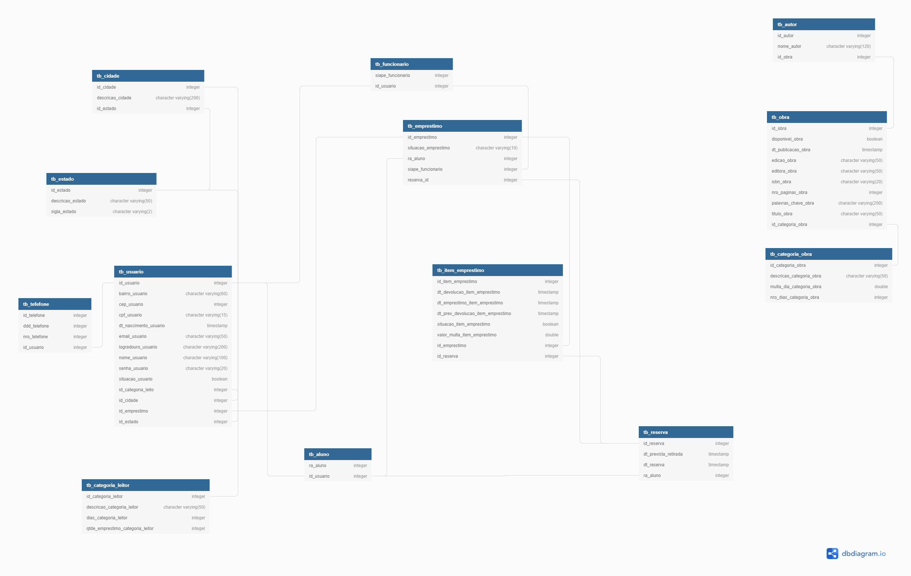

# Biblioteca-UTFPR

O objetivo é implementar uma aplicação para o seguinte sistema de empréstimos/devolução de livros em uma biblioteca.

### Diagrama de Classes

A equipe será composta por 5 pessoas que irão desempenhar os seguintes papéis:

* Usuário do sistema - Nemer;

* Desenvolvedor/projetista - interface gráfica (package IG) - Allan;

* Desenvolvedor/projetista - banco de dados (package BD) - Adriana;

* Desenvolvedor - aplicação (package AP) - Nilson;

* Integrador - Frederico;

Atividades que serão executadas:

Devem ser realizadas reuniões (síncronas ou assíncronas) com o Usuário, para a obtenção de informações e para a validação do sistema;

O Desenvolvedor/projetista - interface gráfica deve validar com o usuário as interfaces gráficas para o sistema (Cadastro de Usuários, Empréstimos/Devoluções, Relatório de Acervo);

O Desenvolvedor/projetista - banco de dados deve projetar e validar o modelo físico de dados, juntamente com o Desenvolvedor/projetista - interface gráfica;

O Desenvolvedor - aplicação deve criar as classes e métodos necessários para a implementação do sistema. Estas classes e métodos devem ser validadas com o Desenvolvedor/projetista - interface gráfica e com o Desenvolvedor/projetista - banco de dados;

O Integrador deve produzir um diagrama de rastreabilidade para demonstrar como cada um dos pacotes estão relacionados, e validar a versão final com o Usuário;

## Tecnologias utilizadas:

Frontend: HTML, CSS, BootStrap, JavaScript

Backend: Java

Database: PostgreSQL

### Pre-requisites:
* Eclipse

## História de Usuário
Análise de Requisitos do projeto.

### Requisitos Funcionais
* F001 – Gerencia de Usuários
* F002 – Empréstimo/Devoluções
* F003 – Gerencia de Acervo
### Requisitos Não Funcionais
* Confiabilidade - RNF001; RNF002; RNF003; RNF004
* Eficiência - RNF005; RNF006; RNF007
* Portabilidade - RNF009
* Compatibilidade - RNF010

## Interface
Algumas telas do sistemas.

### Tela de Gestão de Usuários

### Tela de Gestão de Obras

### Tela de Empréstimos

### Tela Devoluções

## Funcionalidades implementadas:
Nosso projeto gira em torno de três grandes classes. As características de cada classe estão listadas abaixo. 

### 1. Aluno:

### 2. Funcionario:

### 3. Obra:

## Banco de Dados
Modelo do Banco de Dados

## Integração
Diagrama de rastreabilidade contendo todos os artefatos do projeto aprovados pelo usuário.

